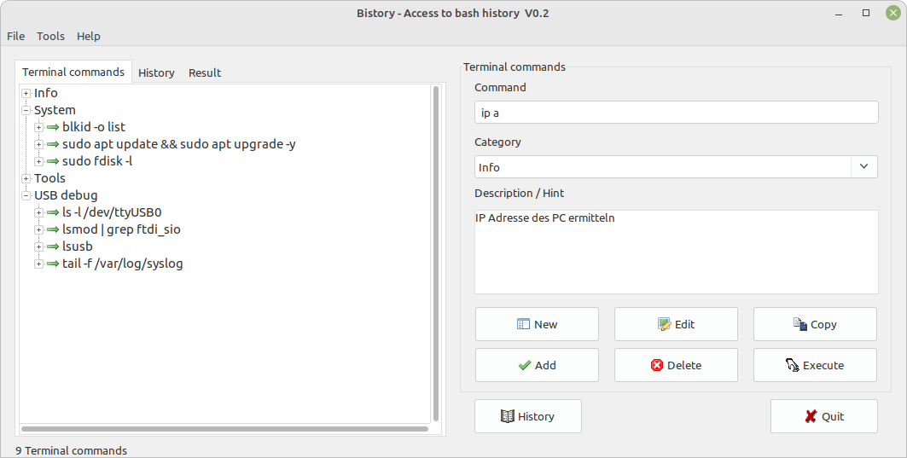

# Bistory
**b**ash h**istory**
**Collect and categorize LINUX terminal commands that one often forget**

The shell in LINUX is a powerful tool - you can do many things very fast and effectively. But who doesn't know: What was the name of the command? And you start searching ...

**What can "Bistory" do:**
You can enter and save terminal commands, sort them into categories and add descriptions.
You can read the bash history and add existing commands to your list. Duplicates are filtered out automatically.
You could also use it as a program launcher. that works, but the terminal window stays open as long as the program is running.

**What it can't do:**
"Bistory" is not a LINUX shell. Scripts, complex commands or those that require user input are not executed properly or the results are not displayed. The terminal always disappears after the command is finished. In such cases you should copy the command to the terminal. The clipboard is your friend.

